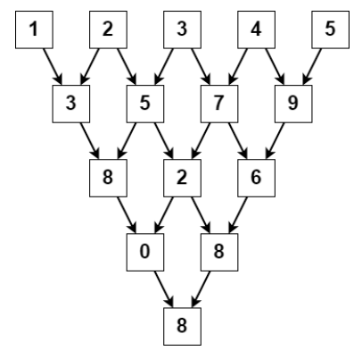
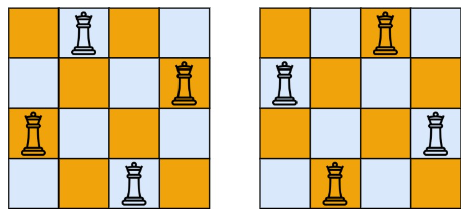
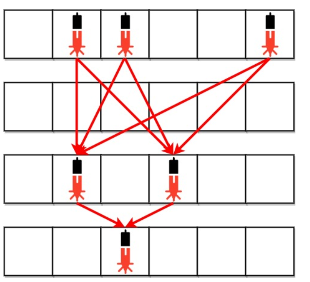
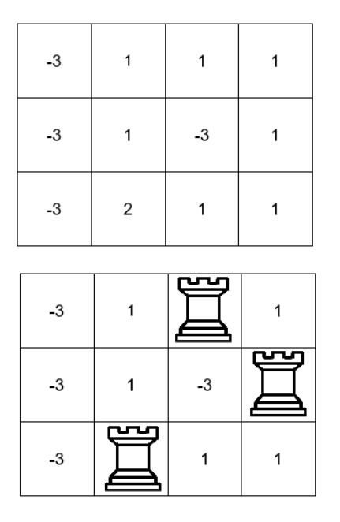

<h1 align="center">Ultra-auto_eval</h1>
<h3>作业自动批改上传成绩</h3>
<a href="./use.md">使用方法</a>


# 测试题

使用C语言输出Hello

示例1：

输出   
```sh
Hello
```


<details>
<summary><h1>怎么创建文件</h1></summary>

1.在仓库首页选择`新建文件`

<p align="center">
  
</p>

2.填写文件名（包括后缀，且文件在根目录）

<p align="center">
  
</p>

</details>

# 文件内容格式
- 第一行填写学号  
- 第二行填写github登录使用的邮箱
- 第三行填写你的姓名

C语言示例：
```c
//202210116122
//3093236313@qq.com
//何嘉
#include <stdio.h>
int main()
{
    printf("Hello World");
    return 0;
}
```

Python示例：
```python
#202210116122
#3093236313@qq.com
#何嘉
print('Hello World')
```

# 文件名格式
- 开头为数字，代表题目序号
- 文件名的分隔符为下划线`_`
- 文件名剩余部分随意
- 后缀为`.c`或者`.py`

**C语言示例：**   
第一题，开头为数字`1`，下划线分割，剩下随意，后缀`.c`   
`1_hello.c`,`1_hahaha.c`,`1_abcd.c`

第5题，开头为数字`5`，下划线分割，剩下随意，后缀`.c`  
`5_hello.c`,`5_hahaha.c`,`5_abcd.c`

---

**Python示例：**   
第一题，开头为数字`1`，下划线分割，剩下随意，后缀`.py`   
`1_hello.py`,`1_hahaha.py`,`1_abcd.py`

第5题，开头为数字`5`，下划线分割，剩下随意，后缀`.py`  
`5_hello.py`,`5_hahaha.py`,`5_abcd.py`

# 分数计算公式

## 1. 评分标准
- **总得分范围**：0 - 100 分  
- **时间评分**（满分 20 分）：  
  - 运行时间 `≤ 2ms` 得满分 `20 分`
  - 运行时间 `≥ 5000ms` 得 `0 分`
  - `2ms` 到 `5000ms` 之间，\( T \) 是程序执行时间（ms），使用**指数衰减公式**计算：
    
$$
S_{\text{time}} = 20 \times e^{-10 \times \frac{T - 2}{5000 - 2}}
$$ 

- **内存评分**（满分 20 分）：  
  - 内存 `≤ 500KB` 得满分 `20 分`
  - 内存 `≥ 60000KB` 得 `0 分`
  - `500KB` 到 `60000KB` 之间，\( M \) 是程序使用的内存（KB），使用**指数衰减公式**计算：

$$
S_{\text{memory}} = 20 \times e^{-1.5 \times \frac{M - 500}{60000 - 500}}
$$

- **测试评分**（满分 60 分）：  
  - 每个测试点平分分数，全部通过得满分 `60 分`
  - 通过测试点 `right` 个，总共 `AllNum` 个测试点，**计算公式**：
    
$$
S_{\text{test}} = right \times \frac{60}{AllNum}
$$

## 2. 总得分计算
$$
S_{\text{total}} = S_{\text{time}} + S_{\text{memory}} + S_{\text{test}}
$$


# 注意❗❗❗

1. 请重新创建仓库，<a href="./use.md">创建教程</a>
2. 目前`MY_URL`已经过期，不要用之前pdf里面旧的了，新的在**群精华**

---
<details>
<summary><h1>Ultra算法组二月测试题</h1></summary>

1. 使用`python`语言答题
2. 一共5道题目
3. 截止日期`2025/02/28 23:59:59`

---

## 第1题

给你一个字符串`jewels`代表石头中宝石的类型，另有一个字符串`stones`代表你拥有的石头，`stones`中每个字符代表了一种你拥有的石头的类型，你想知道你拥有的石头中有多少是宝石

- 字母区分大小写，因此`a`和`A`是不同类型的石头。
- 1 <= `jewels.length`, `stones.length` <= 50
- `jewels`和`stones`仅由英文字母组成
- `jewels`中的所有字符都是**唯一**的
- 输入格式(以`,`为分隔符)：`jewels`,`stones`
- 输出格式：`num`

示例1：

输入   
```sh
aA,aAAbbbb
```   
输出   
```sh
3
```

> 解答：宝石类型为`a`和`A`，`aAAbbbb`中宝石一共有3个

示例2：

输入   
```sh
Ultra,ultra
```   
输出   
```sh
4
```

> 解答：宝石类型为`Ultra`，`ultra`中字母`u`大小写不一样，所以宝石一共有4个

---

## 第2题

给你一个下标从 `0` 开始的整数数组 `nums` ，其中 `nums[i]` 是 `0` 到 `9` 之间（包含 `0` 和 `9`）的一个数字

`nums` 的**三角和**是执行以下操作以后最后剩下元素的值：

- `nums` 初始包含 `n` 个元素。如果 `n == 1` ，终止操作。否则，创建一个新的下标从 `0` 开始的长度为 `n - 1` 的整数数组 `newNums`
  
- 对于满足 `0 <= i < n - 1` 的下标 `i` ，`newNums[i]` 赋值为 `(nums[i] + nums[i+1]) % 10` ，`%` 表示取余运算。将 `newNums` 替换数组 `nums`

- 重复上面整个过程，直到终止操作

- 返回 `nums` 的三角和。
  
- `1 <= nums.length <= 1000`
  
- `0 <= nums[i] <= 9`
  
示例1：

输入   
```sh
1,2,3,4,5
```   
输出   
```sh
8
```


> 解答：如上面图片所示

示例2：

输入   
```sh
4
```   
输出   
```sh
4
```

> 解答：1个元素，终止操作

---

## 第3题

按照国际象棋的规则，皇后可以攻击与之处在同一行或同一列或同一斜线上的棋子

`n` 皇后问题研究的是如何将 `n` 个皇后放置在 `n×n` 的棋盘上，并且使皇后彼此之间不能相互攻击

给你一个整数 `n` ，返回所有不同的 `n` 皇后问题的解决方案

每一种解法包含一个不同的 `n` 皇后问题 的棋子放置方案，该方案中 'Q' 和 '.' 分别代表了皇后和空位

`1 <= n <= 9`

示例1：

输入   
```sh
4
```   
输出   
```sh
[[".Q..","...Q","Q...","..Q."],["..Q.","Q...","...Q",".Q.."]]
```



> 解答：如上面图片所示

示例2：

输入   
```sh
1
```   
输出   
```sh
[["Q"]]
```

> 解答：略

---

## 第4题

银行内部的防盗安全装置已经激活。给你一个下标从 `0` 开始的二进制字符串数组 `bank` ，表示银行的平面图，这是一个大小为 `m x n` 的二维矩阵，每行是一个字符串，行之间用`,`分隔。 `bank[i]` 表示第 `i` 行的设备分布，由若干 `0` 和若干 `1` 组成。`0` 表示单元格是空的，而 `1` 表示单元格有一个安全设备

对任意两个安全设备而言，如果同时满足下面两个条件，则二者之间存在一个激光束：

1. 两个设备位于两个**不同行**：`r1` 和 `r2` ，其中 `r1` < `r2`
2. 满足 `r1 < i < r2` 的所有行 `i` ，都没有安全设备

激光束是独立的，也就是说，一个激光束既不会干扰另一个激光束，也不会与另一个激光束合并成一束

- 返回银行中激光束的总数量
- `m == bank.length`
- `n == bank[i].length`
- `1 <= m, n <= 500`
- `bank[i][j] 为 0 或 1`

示例1：

输入   
```sh
"011001","000000","010100","001000"
```   
输出   
```sh
8
```



> 解答：在下面每组设备对之间，存在一条激光束。总共是 8 条激光束：
> * bank[0][1] -- bank[2][1]
> * bank[0][1] -- bank[2][3]
> * bank[0][2] -- bank[2][1]
> * bank[0][2] -- bank[2][3]
> * bank[0][5] -- bank[2][1]
> * bank[0][5] -- bank[2][3]
> * bank[2][1] -- bank[3][2]
> * bank[2][3] -- bank[3][2]
> 
> 注意，第 0 行和第 3 行上的设备之间不存在激光束。
> 这是因为第 2 行存在安全设备，这不满足第 2 个条件。

示例2：

输入   
```sh
"000","111","000"
```   
输出   
```sh
0
```

> 解答：不存在两个位于不同行的设备

---

## 第5题

给你一个 `m x n` 的二维整数数组 `board` ，它表示一个国际象棋棋盘，其中 `board[i][j]` 表示格子 `(i, j)` 的价值

处于**同一行**或者**同一列**车会互相攻击。你需要在棋盘上放三个车，确保它们两两之间都无法互相攻击

请你返回满足上述条件下，三个车所在格子值之和**最大**为多少

- `3 <= m == board.length <= 100`
- `3 <= n == board[i].length <= 100`
- `-109 <= board[i][j] <= 109`
- 输入行内用`,`分隔，行之间用`/`分隔

示例1：

输入   
```sh
-3,1,1,1/-3,1,-3,1/-3,2,1,1
```   
输出   
```sh
4
```



> 解答：我们可以将车分别放在格子 (0, 2) ，(1, 3) 和 (2, 1) 处，价值之和为 1 + 1 + 2 = 4

示例2：

输入   
```sh
1,1,1/1,1,1/1,1,1
```   
输出   
```sh
3
```

> 解答：我们可以将车分别放在格子 (0, 2) ，(1, 1) 和 (2, 0) 处，价值之和为 1 + 1 + 1 = 3


</details>

---

<details>
<summary><h3>Ultra算法组第0次测试题</h3>❗(已结束)</summary>

编写C语言程序，输入一个数，输出这个数的阶乘   
截止日期`2024/11/09 23:00:00`   
示例：   
输入   
```sh
5
```   
输出   
```sh
120
```

</details>
